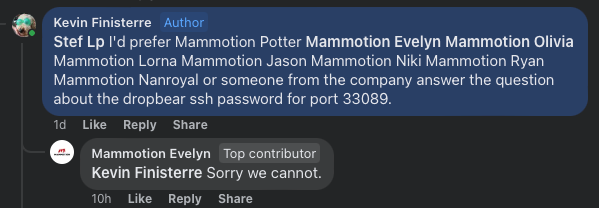
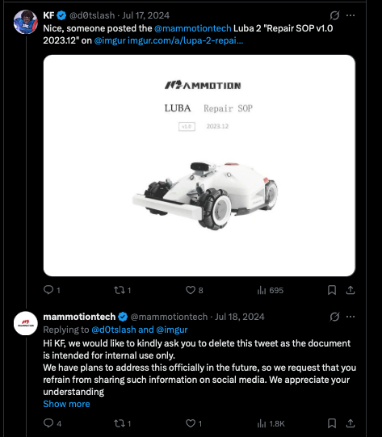

# Mammotion Cloud Security Research

**Researchers:** Sammy Azdoufal ([@n0tsa](https://twitter.com/n0tsa)) · Andreas Makris ([@Bin4ryDigit](https://twitter.com/Bin4ryDigit)) · Kevin Finisterre ([@d0tslash](https://twitter.com/d0tslash))

Kevin has a [few thoughts on the matter](https://x.com/d0tslash/status/2035509757906210977).

---

## The Short Version

We pulled on a thread in the Android app and spent a few days on Mammotion's cloud. 14 criticals. Admin account takeover in two unauthenticated HTTP requests. 337,000 users enumerable with no token. Home WiFi SSID, local IP, and cellular IMSI accessible for any device in the fleet without owning it. Full account takeover lets you log into the official app and drive the victim's robot in FPV.

We also did a live ATO on Kevin's account to prove the chain end to end. OTP brute-force, no rate limiting, his Luba's home network profile pulled cross-account. He knew it was coming and was not surprised.

We reported it. The disclosure process was its own kind of experience.

---

## Background

Kevin has been watching Mammotion for a while. A few years ago he found an open Dropbear SSH service on their robots, reported it, and watched it quietly disappear in a firmware update with no CVE, no notice, no acknowledgment. When he asked support directly for the SSH credentials, the answer was short:



He also found their Luba 2 / Yuka repair SOP manual after Mammotion kept having it deleted from Reddit. He archived it to the Internet Archive. They kept trying to pull it down. He kept archiving it.



Two years later, the public repair documentation they promised customers still does not exist.

We knew what kind of company we were dealing with before we sent the first email. The full paper trail is in [the addendum](#addendum-the-prequel).

---

## The Findings

### The Admin OTP That Never Expired

Mammotion has an internal support endpoint that returns stored verification codes:

```http
POST https://api-account-cn.mammotion.com/v1/internal/verify-code
Content-Type: application/json

{"email":"admin@mammotion.com","verifyCodeType":2}
```

```json
{"code":0,"data":"108961"}
```

No auth. No token. The endpoint hands back whatever OTP is sitting in the database for that email.

For a regular user account this is only useful if there's an active OTP in the DB, meaning a reset was already triggered. On the CN server you can race it: trigger the reset, read the code back before the victim sees the email. Useful but not universal.

For `admin@mammotion.com` it was different. The admin had apparently never triggered their own forgot-password flow, so their stored OTP had no TTL and no rotation. It just sat there.

We called the endpoint across multiple sessions over multiple days. Same six digits every time. 108961. A key left in the lock since the account was created.

Two unauthenticated HTTP requests and you own the Mammotion admin account.

### 337,730 Users Across 85 Countries

All four regional account servers returned full user records for sequential account numbers with no auth:

```http
GET https://api-account-us.mammotion.com/v1/user/user-id?userId=867141338666106880
```

No token. Every sequential integer. No rate limiting. The response:

```json
{
  "userAccount": 22079707,
  "email": "[REDACTED]@gmail.com",
  "userId": "532800298599579648",
  "areaCode": "USA",
  "userState": 1
}
```

Sampling across the four regional servers (US, CN, EU, AP) showed roughly one valid account per seven sequential integers on the US server. Extrapolating from the account number ranges, the global userbase is in the hundreds of thousands. The EU server alone spans 85+ countries, with heavy concentration in Germany, France, and Sweden. No credentials required at any point. Had we chosen to run a full sweep, we estimate we could have pulled approximately 337,000 accounts. We did not.

### Your Robot Is Snitching On You

`POST /device-server/v1/device/info` with `deviceAttribute: networkInfo` returned the following for any device in the fleet, cross-account, no ownership check:

- Home WiFi SSID
- Local IP address
- WiFi and Bluetooth MAC addresses
- 4G IMEI
- SIM IMSI (useful for SS7 cell-tower location tracking)
- SIM ICCID (useful for SIM swap attacks)
- Firmware version, mileage, work hours

Mammotion's EU RTK fleet runs on Orange France M2M SIMs. Every base station with a 4G module, all IMSI `208012xxxxxxx`, handing over cellular identity data to any authenticated app user.

### 46,785 RTK Stations

Mammotion's RTK GPS base stations use sequential serial numbers split across four regional pools:

- RTKBEU: 31,388 units
- RTKBNA: 9,538 units
- RTKBAU: 3,370 units
- RTKBUK: 2,489 units

`/device-server/v2/pool-robot/encryption` returns the RSA-2048 identity blob and decryption key for any of them, no ownership check. We enumerated all 46,785.

### OTP Brute-Force, Kevin's Account

The permanent OTP only existed for the admin account. For everyone else, Mammotion sends a real 6-digit code to the victim's inbox. You can't read it back directly.

What you can do is brute-force it. `/v2/email/forgot-pwd/verify` has zero rate limiting:

```http
POST https://api-account-us.mammotion.com/v2/email/forgot-pwd/verify
{"email":"target@example.com","verificationCode":"000001"}

→ {"code":40208}   ← wrong, keep going
```

100 attempts in a row. No lockout. No CAPTCHA. 10^6 combinations at ~10 req/s single-threaded is 28 hours; at 100 threads it's about 17 minutes.

That's how Sammy took over Kevin's robot. Trigger the forgot-password email, brute the OTP space. Kevin was aware, consented, and Sammy got in.

And then after we took his picture, we mowed Kevin's lawn.


Videos: [Sammy drives Kevin's mower from Spain](https://x.com/d0tslash/status/2035509757906210977) · [part two](https://x.com/d0tslash/status/2036458473668448651)

### The Full Chain

**Admin** (two unauthenticated requests):
1. `POST /v1/internal/verify-code` with `verifyCodeType:2` to get the permanent OTP
2. `PUT /v2/email/password` to set a new password

**Any regular user** (no prior credentials needed):
1. Enumerate a target email from the unauthenticated account endpoint
2. `POST /v2/email/forgot-pwd/code` to send the OTP to their inbox
3. Brute-force `/v2/email/forgot-pwd/verify` until the code lands
4. Reset password, log in
5. Log into the official Mammotion app with the victim's credentials
6. Full FPV control of their robot from the app: live camera feed, joystick driving, mowing plans, room maps
7. GPS coordinates from `/device/location/sync`
8. Agora camera tokens forgeable independently (AppCertificate `F2A95E3449CD4954826A2E0F80A12D2F` hardcoded in APK) without even needing to log in as the victim
9. Unbind the device from their account

No physical access. No prior credentials. Works from the internet. The attacker ends up with more control over the victim's robot than the victim has when their phone dies.

### Other Things

The factory QA system at `tests-server` had no auth. Any authenticated token could inject fake PASS/FAIL records for any device across 50+ test configs and 14 device models. Supply chain integrity on the honor system.

The developer portal at `developer.mammotion.com` ships its OAuth2 `client_secret` in a `NEXT_PUBLIC_` variable baked into the Next.js bundle. Any visitor can read it from source.

Any authenticated user could register an OAuth2 client with an arbitrary `redirectUri`, which opens up phishing flows on `id.mammotion.com`.

Internal subdomains in public DNS: `gitlab.mammotion.com` resolved to `10.12.6.253` (source code server), with `xxljob`, `grafana`, `minio`, and `data` all pointing to `10.65.2.99`. Not externally reachable but a clean map of their internal network.

Password check endpoint with no rate limit: 50 wrong attempts in 5.8 seconds, no lockout.

The device-share endpoint skipped ownership checks when called with the admin token, so you could add any robot to your account after the admin ATO.

Four write endpoints (`properties/set`, `ota/trigger`, `upgrade/trigger`, `setting/sync`) accepted arbitrary device serial numbers via GET and returned success. Whether the commands reached the actual hardware is unconfirmed since we didn't have test devices, but the API layer accepted them without complaint.

---

## The Disclosure

We contacted Mammotion on March 20, 2026 via `support@`, `pr@`, `vulnerability@`, and every address we could find. Kevin CCd the contacts from his SSH disclosure a couple years earlier.

They asked for a description. Andreas told them: multiple criticals, account takeover, GPS, cameras, 337K users at risk, and asked for a secure channel to send details.

A week went by. Kevin pointed out they still hadn't set up `security@mammotion.com`. The `vulnerability@` address they eventually mentioned hadn't received anything. Andreas resent the thread.

When Mammotion's cyber security team finally replied, they said they had "implemented comprehensive safeguards" and work with "professional external security institutions." They declined to open up the underlying system. They thanked us for our "long-term attention and expectations for transparency."

Kevin's response is in the email thread. Worth reading.

Full thread: [emails/disclosure-thread.md](emails/disclosure-thread.md)

---

## Addendum: The Prequel

None of this started in March 2026. Kevin kept the receipts:

- **May 2024** — [where this started](https://x.com/d0tslash/status/1795682475382862104) · [the continuation](https://x.com/d0tslash/status/1797671130448465988) · DJI, proper: [one](https://x.com/d0tslash/status/1797877886504042825), [two](https://x.com/d0tslash/status/1797878816339349848)
- **July 2024** — [the repair SOP drops](https://x.com/d0tslash/status/1813615940610998647)
- **June 2025** — [the repair SOP, still not public](https://x.com/d0tslash/status/1938116592400756850) · [and this](https://x.com/d0tslash/status/1938112386894106795). Two years after "we have plans to address this officially in the future," the plans are still in the future.
- **March 2026** — [the video of Sammy driving Kevin's mower](https://x.com/d0tslash/status/2035509757906210977) · [part two](https://x.com/d0tslash/status/2036458473668448651)

One improvement we'll take partial credit for: a `security@` contact now exists at Mammotion — the minimum viable security inbox, the same thing Kevin had to push Unitree to create. It shouldn't take a public disclosure to get an email address.

---

## Status (verified 2026-08-24)

Everything below was re-tested after public disclosure with read-only probes and a single disposable test account (its tokens were revoked after testing; the one OAuth test client we created was deleted immediately after verification). No third-party accounts were touched, no brute-force was re-run, and no device commands were sent. Items that cannot be re-tested without owned hardware or an admin token are listed at the end.

### Fixed / closed

| Finding | Verification |
|---------|--------------|
| Admin OTP oracle (`POST /v1/internal/verify-code`) | Returns `401 Authentication required` on both the production and test identity servers. |
| Unauthenticated user enumeration (`/v1/user/user-id`, `/v1/user/account-email`) | All four regional account servers no longer resolve in DNS. On `id.mammotion.com`, `user-id` now requires a server-verified `sign` parameter — we could not forge it with any of the credential pairs extractable from the APK (five signature schemes tried), and `account-email` no longer returns other users' data. |
| Pool-robot encryption keys | With a valid account token, `POST /device-server/v2/pool-robot/encryption` no longer returns key material (`50100 Invalid request`), on both the EU and domestic gateways. |
| Device `networkInfo` exposure | Single probes on serial numbers already published in this repo (using our own account, which owns none of them) now return `50501 "Device not bound"` instead of the network profile. |
| Factory QA system (`tests-server`) | All QA read endpoints return `401` across every gateway, both verbs. |
| API documentation exposure | OpenAPI specs, Swagger UI and Knife4j consoles are no longer served on any live host (absent or fully authentication-gated). |
| Internal subdomains in public DNS | `xxljob`, `grafana` and `minio` have been removed. |

### Hardening observed

- Password policy is now enforced at registration (8–16 characters, mixed types; `123456` rejected).
- Email code endpoints are now rate-limited (`40207 "Emails are sent too often"`).
- Changing a password now revokes the account's refresh and access tokens (old refresh token → `40102`, old access token → `401`).
- The current Android app (2.3.18.21, published 2026-08-13) is packed; the Agora certificate from the F23 PoC is no longer statically present in it — rotation itself remains unconfirmed without a live channel.

### Still open

| Finding | Status |
|---------|--------|
| Developer portal `client_secret` in the public JS bundle | Still readable by any visitor. The value was rotated since March, but the replacement is again hardcoded in the current bundle. |
| OAuth2 client self-registration with arbitrary `redirectUri` | Still possible with any user token (verified: test client created, then deleted). |
| `gitlab.mammotion.com` and `data.mammotion.com` in public DNS | Still resolve to internal IPs (`gitlab` → `10.65.7.4`, `data` → `10.192.x.x`). |

### Not re-tested

- Rate limiting on `/v2/email/forgot-pwd/verify` — the endpoint is alive and rejects bad codes, but we did not re-run a brute-force.
- Rate limiting on the password check endpoint.
- Agora certificate rotation (needs a live camera channel).
- Admin device-share ownership bypass and the four write endpoints (`properties/set`, `ota/trigger`, `upgrade/trigger`, `setting/sync`) — both require an admin token or owned hardware, and the admin ATO chain is closed.

---

## Timeline

| Date | Event |
|------|-------|
| 2026-03-19 | Research starts |
| 2026-03-20 | Vendor contacted |
| 2026-03-21 | Admin OTP confirmed. 337K enumeration complete. Full ATO chain proven. |
| 2026-03-21 | Took Kevin's picture |
| 2026-03-21 | Mow'd Kevin's lawn |
| 2026-03-22 | Fleet-wide GPS/WiFi/IMSI exposure documented |
| 2026-03-23 | 46,785 RTK serials enumerated |
| 2026-03-23 | Coordinated disclosure initiated |
| 2026-03-29 | Mammotion still troubleshooting whether their new email works |
| 2026-04-16 | Kevin replies to their apology about "inconvenience" |
| 2026-04-20 | Mammotion's security team explains they have security |
| 2026-04-20 | Kevin's final reply |
| 2026-08-21 | Public disclosure |
| 2026-08-24 | Post-disclosure verification: ATO chain and enumeration closed, QA server gated, docs consoles shut; developer portal secret and OAuth client registration still open |

---

## Credits

**Sammy Azdoufal** ([@n0tsa](https://twitter.com/n0tsa)), security researcher  
**Andreas Makris** ([@Bin4ryDigit](https://twitter.com/Bin4ryDigit)), security researcher  
**Kevin Finisterre** ([@d0tslash](https://twitter.com/d0tslash)), security researcher, sent the RFPolicy to their support team  

Kevin's tweet: https://x.com/d0tslash/status/2035509757906210977

---

*No consumer devices were disrupted. Test accounts were created and deleted. Mammotion's IR team changed the admin password after our PoC, which at least confirmed they were watching the logs.*